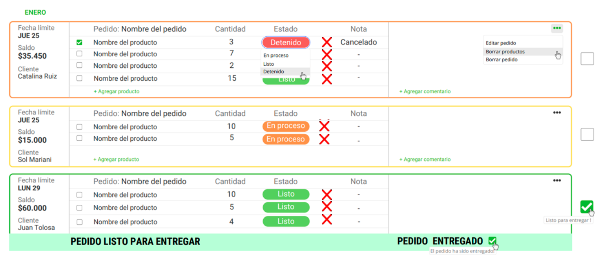

# PIMIENTAS

>[!TIP]
> Si en un carrito Tenemos 30 productos y la mitad de estos estan en estado: En proceso y Detenido. Que al seleccionarlo, no permita finalizar el pedido y entregarlo. O que todas las props de los productos pasen al Estado Listo

     

>[!IMPORTANT]
>Dependiendo del tipo de proceso/tiempo de produccion que tenga el producto que se marque o quede en modo shadow. Hay productos que como no tienen procesos es innecesario visualizar ese campo.

     

>[!NOTE]
>Posibilidad desde esta pestaña de editar pedido / crear pedido, cambiar el cliente al que esta el pedido actual.

     

>[!CAUTION]
>Duplicar pedido y cuando lo hagas, que te solicite a que cliente le vas a brindar el pedido duplicado.

     

>[!WARNING]
>Eliminar producto, se podria desde el dashboard y desde editar/crear pedido. Poder eliminar multiples o individual. Otra opcion es cuando no tenemos stock y por ejemplo el cliente pidio 10 unidades, solo tenemos 5 y queremos finalizar el pedido con estos 5. Por que el cliente nos pide que le entregemos lo que tengamos nomas.
>Con simplemente darle click en la X se borra el producto y es mas rapido que seleccionar 1 a 1 con el checkbox

     

